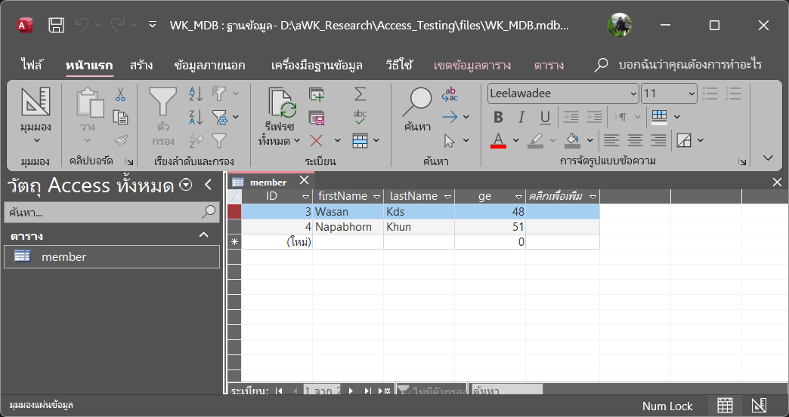
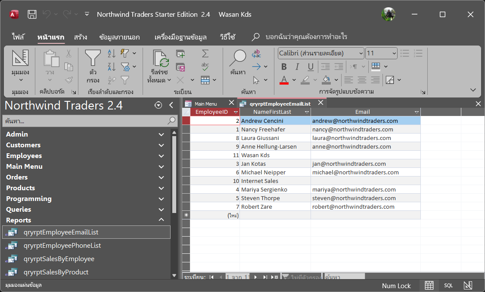

# Access Testing

## วัตถุประสงค์
```
- ใช้สำหรับทดสอบอ่านไฟล์ Access ด้วย Node.js
- ไฟล์ .mdb เป็นไฟล์ Access รุ่นเก่า
- ไฟล์ .accdb เป็นไฟล์ Access รุ่นใหม่
```

## การติดตั้ง
```bash
git clone https://github.com/wasankds/access-testing.git          
cd access-testing
npm install
```

## รูปภาพ
ตัวอย่าง ตาราง Customer ในไฟล์ .mdb


ตัวอย่าง Report ในไฟล์ .accdb



## ผู้พัฒนา
```plaintext
- วสันต์ คุณดิลกเศวต
- wasankds@gmail.com
- Line ID : wasankds
- wasankds.com
```


<!-- 
## วิธีการใช้งาน
อธิบายวิธีการใช้งานเบื้องต้น

## ตัวอย่างการใช้งาน
```js
// ตัวอย่างโค้ดการใช้งาน
```

## Contributing
- Fork โปรเจกต์
- สร้าง branch ใหม่
- ส่ง Pull Request

## License
[MIT](LICENSE)

---

> README นี้ออกแบบมาเพื่อแสดงผลสวยงามใน GitHub -->